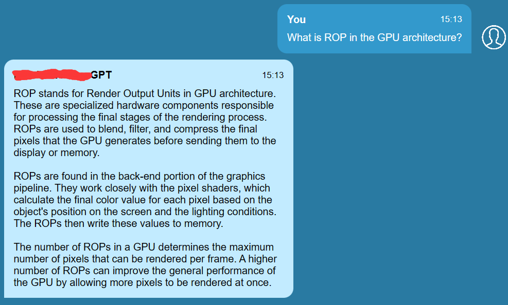
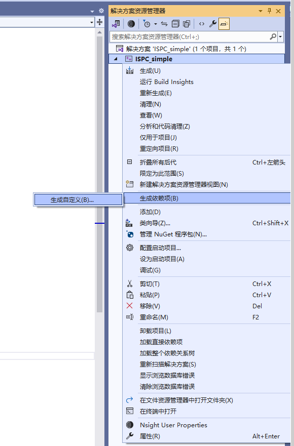
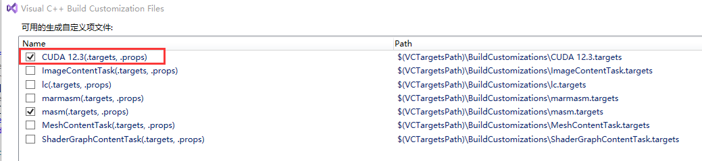
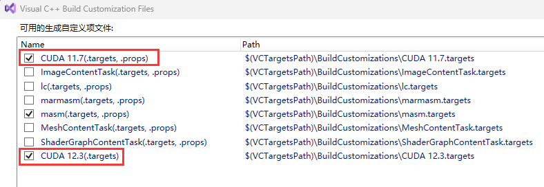
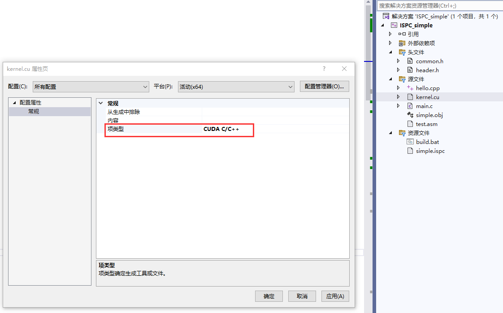
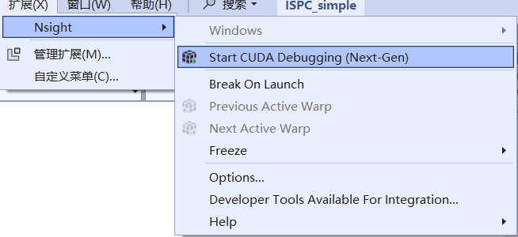
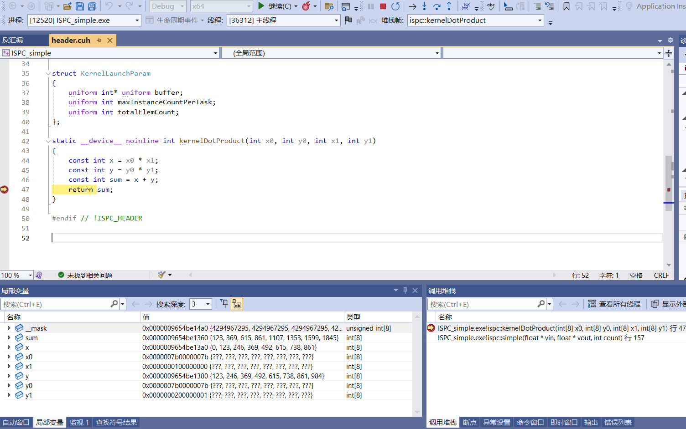
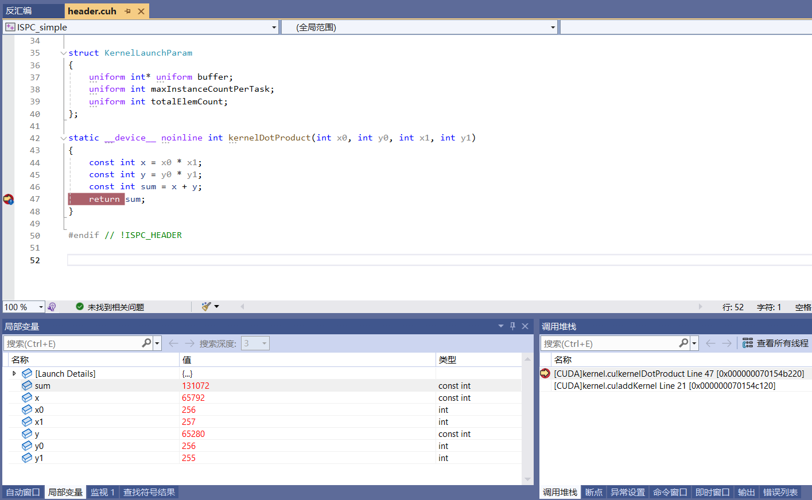

# About GPU architectures docs and demos
各大GPU厂商以及平台商关于3D图形渲染的demo

<br />

## 目录

- [图形相关文章合集](#graphics_relevant_articles_collection)
- [GLSL源文件扩展名](#glsl_source_suffix)
- [GLSL中的一些内建函数用法](#glsl_intrinsic_functions)
- [CUDA相关文档](#cuda_relevant)
- [CUDA样例程序（包含对CUDA Driver API以及 **`clock64()`** 函数的使用）](#cuda_demo)
- [神经网络机器学习相关](#machine_learning_nn)
- [各厂商官方GPU相关架构文档与优化指南](#vendor_gpu_arch_docs)
- [About ISPC_Simple Demo](#about_ispc_simple_demo)

<br />

<a name="graphics_relevant_articles_collection"></a>
## 图形相关文章合集

- [open-gpu-kernel-modules](https://github.com/NVIDIA/open-gpu-kernel-modules)
- [官方Vulkan编程指南](http://www.vulkanprogrammingguide.com)
- [nVidia的图形样例（含Vulkan API）](https://github.com/NVIDIAGameWorks/GraphicsSamples/tree/master/samples)
- [Android Vulkan 图形 API](https://developer.android.google.cn/ndk/guides/graphics)
- [Android Vulkan core topics](https://source.android.google.cn/devices/graphics/arch-vulkan?hl=en)
- [Google官方推荐的用于Android NDK的Vulkan API使用样例](https://github.com/LunarG/VulkanSamples)
- [Google官方的用于Android端的Vulkan API使用样例](https://github.com/googlesamples/android-vulkan-tutorials)
- [Vulkan-Guide](https://github.com/KhronosGroup/Vulkan-Guide)
- [Vulkan Guide](https://docs.vulkan.org/guide/latest/index.html)
- [Vulkan Specification and Proposals](https://docs.vulkan.org/spec/latest/index.html)
- [Vulkan Samples](https://docs.vulkan.org/samples/latest/samples/README.html)
- [Vulkan® and Vulkan® SC API Documentation Project](https://github.com/KhronosGroup/Vulkan-Docs)
- [Vulkan C++ examples and demos](https://github.com/SaschaWillems/Vulkan)
- [Intel技术大牛详解Vulkan API](https://github.com/GameTechDev/IntroductionToVulkan)
- [API without Secrets: Introduction to Vulkan](https://github.com/GameTechDev/IntroductionToVulkan)
- [Vulkan Tutorial](https://vulkan-tutorial.com/Introduction)
- [Vulkan-Cookbook](https://github.com/PacktPublishing/Vulkan-Cookbook)
- [Vulkan Cookbook 第一章 3 连接Vulkan Loader库](https://blog.csdn.net/qq_19473837/article/details/83056962)
- [SPIRV-Guide](https://github.com/KhronosGroup/SPIRV-Guide)
- [VkDeviceCreateInfo](https://registry.khronos.org/vulkan/specs/1.3/html/vkspec.html#VkDeviceCreateInfo)
- [Vulkan features（涉及如何允许逻辑设备全都允许、全都禁用或部分允许特征的方法）](https://registry.khronos.org/vulkan/specs/1.3/html/vkspec.html#features)
- [Vulkan Querying and Enabling Extensions](https://github.com/KhronosGroup/Vulkan-Guide/blob/master/chapters/enabling_extensions.adoc#enabling-extensions)
- 对于某些Vulkan功能扩展，最好从 **Vulkan Instance** 加载Vulkan API。可使用：[vkGetInstanceProcAddr](https://registry.khronos.org/vulkan/specs/1.3-extensions/man/html/vkGetInstanceProcAddr.html)。比如：
```c
PFN_vkGetBufferDeviceAddressEXT custom_vkGetBufferDeviceAddressEXT = 
    (PFN_vkGetBufferDeviceAddressEXT)vkGetInstanceProcAddr(s_instance, "vkGetBufferDeviceAddressEXT");
```
- 如果从 **Vulkan Instance** 无法加载，那么可以尝试从Vulkan设备加载Vulkan API，通过：[vkGetDeviceProcAddr](https://registry.khronos.org/vulkan/specs/1.3-extensions/man/html/vkGetDeviceProcAddr.html)。比如：
```c
PFN_vkCmdPushDescriptorSetWithTemplateKHR spec_PFN_vkCmdPushDescriptorSetWithTemplateKHR = 
    (PFN_vkCmdPushDescriptorSetWithTemplateKHR)vkGetDeviceProcAddr(s_specDevice, "vkCmdPushDescriptorSetWithTemplateKHR");
```
- [Understanding Vulkan Synchronization](https://www.khronos.org/blog/understanding-vulkan-synchronization)
- [Vulkan Push Constants](https://registry.khronos.org/vulkan/site/guide/latest/push_constants.html)
- [Pipeline Dynamic State](https://registry.khronos.org/vulkan/site/guide/latest/dynamic_state.html)
- [Vulkan Timeline Semaphores](https://www.khronos.org/blog/vulkan-timeline-semaphores)
- [Vulkan Subgroup Tutorial](https://www.khronos.org/blog/vulkan-subgroup-tutorial)
- [Ray Tracing In Vulkan](https://www.khronos.org/blog/ray-tracing-in-vulkan)
- [RayTracingInVulkan](https://github.com/GPSnoopy/RayTracingInVulkan)
- [Provide functionality equivalent to GL_EXT_shader_framebuffer_fetch](https://github.com/KhronosGroup/Vulkan-Docs/issues/1649)
- [You Can Use Vulkan Without Pipelines Today](https://www.khronos.org/blog/you-can-use-vulkan-without-pipelines-today)
- [Machine Learning Acceleration in Vulkan with Cooperative Matrices](https://developer.nvidia.com/blog/machine-learning-acceleration-vulkan-cooperative-matrices/)
- [vk_cooperative_matrix_perf](https://github.com/jeffbolznv/vk_cooperative_matrix_perf)
- [DrawIndex](https://registry.khronos.org/vulkan/specs/1.3-extensions/man/html/DrawIndex.html)
- [VK_KHR_display](https://registry.khronos.org/vulkan/specs/1.3-extensions/man/html/VK_KHR_display.html)
- [VK_KHR_display_swapchain](https://registry.khronos.org/vulkan/specs/1.3-extensions/man/html/VK_KHR_display_swapchain.html)
- [VK_KHR_shader_float16_int8](https://registry.khronos.org/vulkan/specs/1.3-extensions/man/html/VK_KHR_shader_float16_int8.html)
- [VK_KHR_8bit_storage](https://registry.khronos.org/vulkan/specs/1.3-extensions/man/html/VK_KHR_8bit_storage.html)
- [VK_KHR_16bit_storage](https://registry.khronos.org/vulkan/specs/1.3-extensions/man/html/VK_KHR_16bit_storage.html)
- [VK_KHR_shader_integer_dot_product](https://registry.khronos.org/vulkan/specs/1.3-extensions/man/html/VK_KHR_shader_integer_dot_product.html)
- [VK_KHR_cooperative_matrix](https://registry.khronos.org/vulkan/specs/1.3-extensions/man/html/VK_KHR_cooperative_matrix.html)
- [VK_KHR_shader_float_controls](https://registry.khronos.org/vulkan/specs/1.3-extensions/man/html/VK_KHR_shader_float_controls.html)
- [VK_KHR_shader_clock](https://registry.khronos.org/vulkan/specs/1.3-extensions/man/html/VK_KHR_shader_clock.html)
- [VK_KHR_variable_pointers](https://registry.khronos.org/vulkan/specs/1.3-extensions/man/html/VK_KHR_variable_pointers.html)（留意看里面的链接：[SPV_KHR_variable_pointers](https://htmlpreview.github.io/?https://github.com/KhronosGroup/SPIRV-Registry/blob/master/extensions/KHR/SPV_KHR_variable_pointers.html)）
- [VK_KHR_storage_buffer_storage_class](https://registry.khronos.org/vulkan/specs/1.3-extensions/man/html/VK_KHR_storage_buffer_storage_class.html)
- [VK_KHR_buffer_device_address](https://registry.khronos.org/vulkan/specs/1.3-extensions/man/html/VK_KHR_buffer_device_address.html)
- [VK_KHR_shader_non_semantic_info](https://registry.khronos.org/vulkan/specs/1.3-extensions/man/html/VK_KHR_shader_non_semantic_info.html)
- [VK_KHR_pipeline_executable_properties](https://registry.khronos.org/vulkan/specs/1.3-extensions/man/html/VK_KHR_pipeline_executable_properties.html)
- [VK_KHR_push_descriptor](https://registry.khronos.org/vulkan/specs/1.3-extensions/man/html/VK_KHR_push_descriptor.html)
- [VK_KHR_descriptor_update_template](https://registry.khronos.org/vulkan/specs/1.3-extensions/man/html/VK_KHR_descriptor_update_template.html)
- [VK_KHR_fragment_shading_rate](https://registry.khronos.org/vulkan/specs/1.3-extensions/man/html/VK_KHR_fragment_shading_rate.html)
- [VK_KHR_fragment_shading_rate](https://github.com/KhronosGroup/Vulkan-Docs/blob/main/proposals/VK_KHR_fragment_shading_rate.adoc)
- [VK_KHR_fragment_shader_barycentric](https://registry.khronos.org/vulkan/specs/1.3-extensions/man/html/VK_KHR_fragment_shader_barycentric.html)
- [VK_KHR_multiview](https://registry.khronos.org/vulkan/specs/1.3-extensions/man/html/VK_KHR_multiview.html)
- [VK_EXT_robustness2](https://registry.khronos.org/vulkan/specs/1.3-extensions/man/html/VK_EXT_robustness2.html)
- [VK_EXT_subgroup_size_control](https://registry.khronos.org/vulkan/specs/1.3-extensions/man/html/VK_EXT_subgroup_size_control.html)
- [VK_EXT_validation_cache](https://registry.khronos.org/vulkan/specs/1.3-extensions/man/html/VK_EXT_validation_cache.html)
- [VK_EXT_conservative_rasterization](https://registry.khronos.org/vulkan/specs/1.3-extensions/man/html/VK_EXT_conservative_rasterization.html)
- [VK_EXT_sample_locations](https://registry.khronos.org/vulkan/specs/1.3-extensions/man/html/VK_EXT_sample_locations.html)
- [VK_EXT_multisampled_render_to_single_sampled](https://registry.khronos.org/vulkan/specs/1.3-extensions/man/html/VK_EXT_multisampled_render_to_single_sampled.html)
- [VK_EXT_sampler_filter_minmax](https://registry.khronos.org/vulkan/specs/1.3-extensions/man/html/VK_EXT_sampler_filter_minmax.html)
- [VK_EXT_provoking_vertex](https://registry.khronos.org/vulkan/specs/1.3-extensions/man/html/VK_EXT_provoking_vertex.html)
- [VK_EXT_mesh_shader](https://registry.khronos.org/vulkan/specs/1.3-extensions/man/html/VK_EXT_mesh_shader.html)（依赖的GLSL扩展：[GL_EXT_mesh_shader](https://github.com/KhronosGroup/GLSL/blob/master/extensions/ext/GLSL_EXT_mesh_shader.txt)）
- [VK_EXT_shader_tile_image](https://registry.khronos.org/vulkan/specs/1.3-extensions/man/html/VK_EXT_shader_tile_image.html)（依赖的GLSL扩展：[GL_EXT_shader_tile_image](https://github.com/janharaldfredriksen-arm/GLSL/blob/GL_EXT_shader_tile_image/extensions/ext/GLSL_EXT_shader_tile_image.txt)）
- [VK_EXT_fragment_shader_interlock](https://registry.khronos.org/vulkan/specs/1.3-extensions/man/html/VK_EXT_fragment_shader_interlock.html)（依赖的GLSL扩展：[GL_ARB_fragment_shader_interlock](https://registry.khronos.org/OpenGL/extensions/ARB/ARB_fragment_shader_interlock.txt)）
- [VK_EXT_rasterization_order_attachment_access](https://registry.khronos.org/vulkan/specs/1.3-extensions/man/html/VK_EXT_rasterization_order_attachment_access.html)
- [VK_EXT_extended_dynamic_state3](https://registry.khronos.org/vulkan/specs/1.3-extensions/man/html/VK_EXT_extended_dynamic_state3.html)

> Single pixel fragments and multi-pixel fragments defined by a [fragment density map](https://registry.khronos.org/vulkan/specs/1.3-extensions/html/vkspec.html#renderpass-fragmentdensitymapattachment) have one set of samples. Multi-pixel fragments defined by a [shading rate image](https://registry.khronos.org/vulkan/specs/1.3-extensions/html/vkspec.html#primsrast-shading-rate-image) have one set of samples per pixel. Multi-pixel fragments defined by setting the [fragment shading rate](https://registry.khronos.org/vulkan/specs/1.3-extensions/html/vkspec.html#primsrast-fragment-shading-rate) have one set of samples per pixel. Each set of samples has a number of samples determined by [`VkPipelineMultisampleStateCreateInfo`](https://registry.khronos.org/vulkan/specs/1.3-extensions/html/vkspec.html#VkPipelineMultisampleStateCreateInfo)::`rasterizationSamples`. Each sample in a set is assigned a unique sample index i in the range [0, rasterizationSamples). <br/><br/> To dynamically set the rasterizationSamples, call:

```c
// Provided by VK_EXT_extended_dynamic_state3, VK_EXT_shader_object
void vkCmdSetRasterizationSamplesEXT(
    VkCommandBuffer                             commandBuffer,
    VkSampleCountFlagBits                       rasterizationSamples);
```

- [VK_EXT_descriptor_indexing](https://registry.khronos.org/vulkan/specs/1.3-extensions/man/html/VK_EXT_descriptor_indexing.html)
- [VK_EXT_shader_object](https://registry.khronos.org/vulkan/specs/1.3-extensions/man/html/VK_EXT_shader_object.html)
- [VK_EXT_debug_marker](https://registry.khronos.org/vulkan/specs/1.3-extensions/man/html/VK_EXT_debug_marker.html)
- [FragStencilRefEXT](https://registry.khronos.org/vulkan/specs/1.3-extensions/man/html/FragStencilRefEXT.html)
- [VK_HUAWEI_subpass_shading](https://registry.khronos.org/vulkan/specs/1.3-extensions/man/html/VK_HUAWEI_subpass_shading.html)
- [VK_NV_device_generated_commands](https://registry.khronos.org/vulkan/specs/1.3-extensions/man/html/VK_NV_device_generated_commands.html)
- [VK_AMD_shader_info](https://registry.khronos.org/vulkan/specs/1.3-extensions/man/html/VK_AMD_shader_info.html)
- [VK_AMD_shader_core_properties](https://registry.khronos.org/vulkan/specs/1.3-extensions/man/html/VK_AMD_shader_core_properties.html)
- [Translate GLSL to SPIR-V for Vulkan at Runtime](https://lxjk.github.io/2020/03/10/Translate-GLSL-to-SPIRV-for-Vulkan-at-Runtime.html)
- [How to Install LunarG Vulkan SDK for Ubuntu](https://support.amd.com/en-us/kb-articles/Pages/Install-LunarG-Vulkan-SDK.aspx)
- [Layers Overview and Configuration](https://vulkan.lunarg.com/doc/view/1.2.131.1/windows/layer_configuration.html)
- Vulkan中对`VK_INSTANCE_LAYERS`环境变量的设置：（Windows: `set VK_INSTANCE_LAYERS=VK_LAYER_LUNARG_api_dump;VK_LAYER_KHRONOS_validation`；Linux：`export VK_INSTANCE_LAYERS=VK_LAYER_LUNARG_api_dump:VK_LAYER_KHRONOS_validation`）
- [Vulkan GFXReconstruct API Capture and Replay](https://vulkan.lunarg.com/doc/view/1.2.141.0/windows/capture_tools.html)
- [Vulkan官方SDK下载](https://www.vulkan.org/tools#download-these-essential-development-tools)
- 查看Vulkan设备信息：运行官方SDK目录下的Bin目录下的 **`vulkaninfoSDK`**
- 将GLSL源文件编译为spv文件可以用VulkanSDK自带的 **`glslangValidator`** 工具。具体用法比如：**`%VK_SDK_PATH%/Bin/glslangValidator  --target-env vulkan1.1  -o texturingKernel.spv  texturingKernel.comp`**。这里需要注意的是， **`glslangValidator`** 工具是根据文件后缀名来判定当前所要编译的GLSL属于哪种类型的shader，所以这里不能使用通用的 **`.glsl`** 文件后缀名。但是，我们可以对shader文件使用shader类型名后面再跟 **`.glsl`** 的方式让 **`glslangValidator`** 工具做shader类型识别。比如我们要编译一个vertex shader文件，可以将文件名命名为：**`flatten.vert.glsl`**；然后使用命令行 **`%VK_SDK_PATH%/Bin/glslangValidator  --target-env vulkan1.1  -o flatten.vert.spv  flatten.vert.glsl`** 进行编译。
- Windows系统端要想将glsl文件编译为spv文件，还可以使用Vulkan SDK自带的 **`glslc`**。具体用法比如：**`%VK_SDK_PATH%/Bin/glslc.exe  -fshader-stage=compute  -o simpleKernel.spv  simpleKernel.glsl`**。它能指定当前要编译的GLSL源文件属于哪种shader类型，因此文件后缀名基本可以随意定义。
- 将SPIR-V可读性的汇编转为SPIR-V字节码文件（spv文件）：**`spirv-as`**。具体用法比如：**`%VK_SDK_PATH%/Bin/spirv-as  -o simpleKernel.spv  simpleKernel.spvasm`**。
- 将spv字节码反汇编为可读的SPIR-V的格式，使用 **`spirv-dis`**。具体用法比如：**`%VK_SDK_PATH%/Bin/spirv-dis simpleKernel.spv  -o simpleKernel.spvasm`**。
- 将spv字节码反编译为GLSL：使用 **`spirv-cross`**。具体用法比如：**`%VK_SDK_PATH%/Bin/spirv-cross  --vulkan-semantics  --output dst.glsl  src.spv`**
- [SPIR-V Extended Instruction Sets](https://github.com/KhronosGroup/SPIRV-Guide/blob/master/chapters/extended_instruction_sets.md)
- [HLSL for Vulkan: Resources](https://antiagainst.github.io/post/hlsl-for-vulkan-resources/)
- [How to compile HLSL shaders with Vulkan?](https://stackoverflow.com/questions/61387495/how-to-compile-hlsl-shaders-with-vulkan)
- [Google官方OpenCL C转SPIR-V项目](https://github.com/google/clspv)
- [SIGGRAPH 2018上提供的Vulkan API使用demo](http://web.engr.oregonstate.edu/~mjb/vulkan/)
- [Direct3D graphics glossary](https://learn.microsoft.com/en-us/windows/uwp/graphics-concepts/)
- [Direct3D 9 Graphics](https://learn.microsoft.com/en-us/windows/win32/direct3d9/dx9-graphics)
- [Programming guide for Direct3D 11](https://github.com/MicrosoftDocs/win32/blob/docs/desktop-src/direct3d11/dx-graphics-overviews.md)
- [Direct3D 11 Graphics](https://learn.microsoft.com/en-us/windows/win32/direct3d11/atoc-dx-graphics-direct3d-11)
- [Direct3D 11.3 Functional Specification](https://microsoft.github.io/DirectX-Specs/d3d/archive/D3D11_3_FunctionalSpec.htm)（包含所有 shader stages，以及 stream output、output merger 等阶段，以及 [**Target Independent Rasterization**](https://microsoft.github.io/DirectX-Specs/d3d/archive/D3D11_3_FunctionalSpec.htm#TIR) 等 features）
- [Direct3D 11 Graphics pipeline](https://learn.microsoft.com/en-us/windows/win32/direct3d11/overviews-direct3d-11-graphics-pipeline)
- [Direct3D 12 programming guide](https://github.com/MicrosoftDocs/win32/blob/docs/desktop-src/direct3d12/directx-12-programming-guide.md)
- [Direct3D 12 graphics](https://learn.microsoft.com/en-us/windows/win32/direct3d12/direct3d-12-graphics)
- [DirectX-Specs](https://microsoft.github.io/DirectX-Specs/)（其中，HLSL 部分包含了完整的各个 Shader Model 所支持的 features。）
- [Direct3D feature levels](https://learn.microsoft.com/en-us/windows/win32/direct3d11/overviews-direct3d-11-devices-downlevel-intro)
- [D3D12_FEATURE_DATA_FORMAT_SUPPORT structure (d3d12.h)](https://learn.microsoft.com/en-us/windows/win32/api/d3d12/ns-d3d12-d3d12_feature_data_format_support)
- [Important Changes from Direct3D 11 to Direct3D 12](https://learn.microsoft.com/en-us/windows/win32/direct3d12/important-changes-from-directx-11-to-directx-12)
- [Porting from Direct3D 11 to Direct3D 12 -- Resource state](https://learn.microsoft.com/en-us/windows/win32/direct3d12/porting-from-direct3d-11-to-direct3d-12#resource-state)
- [DirectX-Graphics-Samples](https://github.com/microsoft/DirectX-Graphics-Samples)
- [Using Resource Barriers to Synchronize Resource States in Direct3D 12](https://learn.microsoft.com/en-us/windows/win32/direct3d12/using-resource-barriers-to-synchronize-resource-states-in-direct3d-12)
- [Helper structures and functions for Direct3D 12](https://learn.microsoft.com/en-us/windows/win32/direct3d12/helper-structures-and-functions-for-d3d12) -- [directx repository](https://github.com/microsoft/DirectX-Headers/tree/main/include/directx)
- [Direct3D 11 Graphics Using System-Generated Values](https://learn.microsoft.com/en-us/windows/win32/direct3d11/d3d10-graphics-programming-guide-input-assembler-stage-using)
- [Common root signature errors compilation](https://gist.github.com/shorttermmem/a14ab1e8980d01ac36943d0f4a8117d9)
- [Microsoft基于D3D12的图形编程样例](https://github.com/Microsoft/DirectX-Graphics-Samples)
- [microsoft/Xbox-ATG-Samples](https://github.com/microsoft/Xbox-ATG-Samples)
- [D3D12 Indirect Drawing](https://learn.microsoft.com/en-us/windows/win32/direct3d12/indirect-drawing)
- [DirectX-Specs -- D3D12 Indirect Drawing](https://microsoft.github.io/DirectX-Specs/d3d/IndirectDrawing.html)
- [Direct3D 12 -- Indirect drawing and GPU culling](https://github.com/MicrosoftDocs/win32/blob/docs/desktop-src/direct3d12/indirect-drawing-and-gpu-culling-.md)
- [ID3D12GraphicsCommandList::ExecuteIndirect method](https://learn.microsoft.com/en-us/windows/win32/api/d3d12/nf-d3d12-id3d12graphicscommandlist-executeindirect)
- [DirectX-Specs -- Mesh Shader ExecuteIndirect](https://microsoft.github.io/DirectX-Specs/d3d/MeshShader.html#executeindirect)
- [DirectX Raytracing (DXR) Functional Spec ExecuteIndirect](https://microsoft.github.io/DirectX-Specs/d3d/Raytracing.html#executeindirect)
- [D3D12 View Instancing Functional Spec](https://microsoft.github.io/DirectX-Specs/d3d/ViewInstancing.html)
- [D3D11.2 Min/Max reduction filtering](https://learn.microsoft.com/en-us/windows/win32/direct3d11/tiled-resources-texture-sampling-features#minmax-reduction-filtering)
- [Shader Specified Stencil Reference Value \(Direct3D 12 Graphics\)](https://learn.microsoft.com/en-us/windows/win32/direct3d12/shader-specified-stencil-reference-value)
- [DirectX-Specs -- Enhanced Barriers](https://microsoft.github.io/DirectX-Specs/d3d/D3D12EnhancedBarriers.html)
- [DirectX-Specs -- D3D12 Shader Cache APIs](https://microsoft.github.io/DirectX-Specs/d3d/ShaderCache.html)
- [nBody DirectX 12 sample (asynchronous compute version)](https://gpuopen.com/gaming-product/nbody-directx-12-async-compute-edition/)
- [D3D12 Resource Binding Functional Spec](https://microsoft.github.io/DirectX-Specs/d3d/ResourceBinding.html)
- [Resource binding in HLSL](https://learn.microsoft.com/en-us/windows/win32/direct3d12/resource-binding-in-hlsl)（解释了 **SRV**、**`UAV`** 等资源的 binding）
- [Why talking about the Root Signature?](https://logins.github.io/graphics/2020/06/26/DX12RootSignatureObject.html)
- [IDXGIDebug::ReportLiveObjects method \(dxgidebug.h\)](https://learn.microsoft.com/en-us/windows/win32/api/dxgidebug/nf-dxgidebug-idxgidebug-reportliveobjects)
- [cannot get rid of live objects \(D3D11\)](https://www.gamedev.net/forums/topic/664906-cannot-get-rid-of-live-objects-d3d11/)
- [Programming guide for HLSL](https://learn.microsoft.com/en-us/windows/win32/direct3dhlsl/dx-graphics-hlsl-pguide)
- [HLSL Specifications](https://microsoft.github.io/hlsl-specs/)
- [HLSL-specs Inline SPIR-V](https://microsoft.github.io/hlsl-specs/proposals/0011-inline-spirv.html)
- [hlsl-specs Unions](https://microsoft.github.io/hlsl-specs/proposals/0004-unions.html)
- [HLSL Keywords](https://learn.microsoft.com/en-us/windows/win32/direct3dhlsl/dx-graphics-hlsl-appendix-keywords)
- HLSL 中，**SV_** 前缀表示 **System-Value**。详细见：[System-Value Semantics](https://learn.microsoft.com/en-us/windows/win32/direct3dhlsl/dx-graphics-hlsl-semantics#system-value-semantics)
- [Direct3D 11 -- Using System-Generated Values](https://learn.microsoft.com/en-us/windows/win32/direct3d11/d3d10-graphics-programming-guide-input-assembler-stage-using)
- HLSL 文件后缀名为：**`.hlsl`**。编译后的目标文件名为：**`.cso`**。详细可见：[Compiling shaders](https://learn.microsoft.com/en-us/windows/win32/direct3dhlsl/dx-graphics-hlsl-part1)
- [HLSL 16 Bit Scalar Types](https://github.com/microsoft/DirectXShaderCompiler/wiki/16-Bit-Scalar-Types)
- [HLSL earlydepthstencil](https://learn.microsoft.com/en-us/windows/win32/direct3dhlsl/sm5-attributes-earlydepthstencil)
- [Wave Intrinsics](https://github.com/Microsoft/DirectXShaderCompiler/wiki/Wave-Intrinsics)
- [HLSL Shader Model 6.6 Atomic Operations](https://microsoft.github.io/DirectX-Specs/d3d/HLSL_SM_6_6_Int64_and_Float_Atomics.html)（同时可参考 GLSL 关于 [imageAtomicExchange](https://registry.khronos.org/OpenGL-Refpages/gl4/html/imageAtomicExchange.xhtml) 以及 [memoryBarrierImage](https://registry.khronos.org/OpenGL-Refpages/gl4/html/memoryBarrierImage.xhtml)）
- [SV_Barycentrics](https://github.com/microsoft/DirectXShaderCompiler/wiki/SV_Barycentrics)
- [SV_ViewID](https://github.com/Microsoft/DirectXShaderCompiler/wiki/SV_ViewID)
- [SV_StencilRef](https://learn.microsoft.com/en-us/windows/win32/direct3dhlsl/sv-stencilref)
- [Direct3D 12 raytracing HLSL system value intrinsics](https://github.com/MicrosoftDocs/win32/blob/docs/desktop-src/direct3d12/direct3d-12-raytracing-hlsl-system-value-intrinsics.md)
- [dcl_immediateConstantBuffer (sm4 - asm)](https://learn.microsoft.com/en-us/windows/win32/direct3dhlsl/dcl-immediateconstantbuffer)
- [图形2.3 HLSL常用函数](https://www.bilibili.com/opus/594384076038418704)
- [What is DXBC?](https://devcodef1.com/news/1014573/converting-dxbc-back-to-hlsl)

> DXBC is a binary format used by DirectX to store compiled shader code. This format is used to improve performance by allowing the graphics card to quickly load and execute the shader code. However, DXBC is not human-readable, which makes it difficult to modify or debug the shader code.

- [DirectX Intermediate Language](https://github.com/microsoft/DirectXShaderCompiler/blob/main/docs/DXIL.rst)
- [Running Shaders in DXIL](https://stackoverflow.com/questions/55958231/running-shaders-in-dxil)
- [Direct2D](https://learn.microsoft.com/en-us/windows/win32/direct2d/direct2d-portal)
- [Direct2D Custom effects](https://learn.microsoft.com/en-us/windows/win32/direct2d/custom-effects)
- [GPU preemption](https://learn.microsoft.com/en-us/windows-hardware/drivers/display/gpu-preemption)
- [WHQL Release Signature](https://learn.microsoft.com/en-us/windows-hardware/drivers/install/whql-release-signature)
- [nVidia关于最新D3D的样例](https://developer.nvidia.com/gameworks-directx-samples)
- [nVidia关于D3D11的样例](https://developer.nvidia.com/dx11-samples)
- [NVIDIA NVAPI](https://docs.nvidia.com/gameworks/content/gameworkslibrary/coresdk/nvapi/index.html)
- [NVIDIA/nvapi](https://github.com/NVIDIA/nvapi)
- [Introduction to 3D Game Programming With DirectX 11书中代码样例](https://github.com/jjuiddong/Introduction-to-3D-Game-Programming-With-DirectX11)
- [Introduction to 3D Game Programming with DirectX 12书中代码样例](https://github.com/d3dcoder/d3d12book/)
- [Metal API介绍](https://developer.apple.com/metal/)
- [Metal developer workflows](https://developer.apple.com/documentation/Xcode/Metal-developer-workflows)
- [Tailor Your Apps for Apple GPUs and Tile-Based Deferred Rendering](https://developer.apple.com/documentation/metal/tailor_your_apps_for_apple_gpus_and_tile-based_deferred_rendering?language=objc)
- [Using a Render Pipeline to Render Primitives](https://developer.apple.com/documentation/metal/using_a_render_pipeline_to_render_primitives?language=objc)
- [Metal Sample Code](https://developer.apple.com/metal/sample-code/)
- [Introduction to Tessellation in Metal](https://metalbyexample.com/tessellation/)
- [Mesh Shaders and Meshlet Culling in Metal 3](https://metalbyexample.com/mesh-shaders/)
- [15. Tile-Based Deferred Rendering](https://www.kodeco.com/books/metal-by-tutorials/v3.0/chapters/15-tile-based-deferred-rendering)
- [Metal 2 on A11-The Shading](https://nilotic.github.io/2018/10/02/Metal-2-on-A11-The-Shading.html)
- [Metal2研发笔录（五）：Forward+ with Tile Shading](https://zhuanlan.zhihu.com/p/95567955)
- [Metal2研发笔录（六）：Metal图像处理后处理基础（上）](https://zhuanlan.zhihu.com/p/98782433)（包含对 tile shader 的使用）
- [DirectX-Specs -- **Mesh Shader**](https://microsoft.github.io/DirectX-Specs/d3d/MeshShader.html)
- [Coming to DirectX 12— Mesh Shaders and Amplification Shaders: Reinventing the Geometry Pipeline](https://devblogs.microsoft.com/directx/coming-to-directx-12-mesh-shaders-and-amplification-shaders-reinventing-the-geometry-pipeline/)
- [Mesh Shading for Vulkan](https://www.khronos.org/blog/mesh-shading-for-vulkan)
- [Introduction to Turing Mesh Shaders](https://developer.nvidia.com/blog/introduction-turing-mesh-shaders/)
- [Using Mesh Shaders for Professional Graphics](https://developer.nvidia.com/blog/using-mesh-shaders-for-professional-graphics/)
- [Quick Introduction to Mesh Shaders (OpenGL and Vulkan)](https://www.geeks3d.com/20200519/introduction-to-mesh-shaders-opengl-and-vulkan/)
- [DirectX Raytracing \(DXR\) Functional Spec](https://microsoft.github.io/DirectX-Specs/d3d/Raytracing.html)
- [Direct3D 12 Raytracing](https://learn.microsoft.com/en-us/windows/win32/direct3d12/direct3d-12-raytracing)
- [Direct3D 12 raytracing samples](https://learn.microsoft.com/en-us/samples/microsoft/directx-graphics-samples/d3d12-raytracing-samples-win32/)
- [OpenGL wiki](https://en.wikipedia.org/wiki/OpenGL)
- [History of OpenGL](https://www.khronos.org/opengl/wiki/History%20of%20OpenGL)
- [基于macOS的OpenGL的使用](https://developer.apple.com/opengl/)
- [Tutorial 12 : OpenGL Extensions](http://www.opengl-tutorial.org/intermediate-tutorials/tutorial-12-opengl-extensions/)
- [OpenGL Programming/Installation/Linux](https://en.wikibooks.org/wiki/OpenGL_Programming/Installation/Linux)
- [How to install OpenGL/GLUT libraries for Ubuntu](https://askubuntu.com/questions/96087/how-to-install-opengl-glut-libraries)
- [FreeGLUT API](http://freeglut.sourceforge.net/docs/api.php)
- [OpenGL on Windows](https://docs.microsoft.com/zh-cn/windows/win32/opengl/opengl)
- [Creating an OpenGL Context (WGL)](https://www.khronos.org/opengl/wiki/Creating_an_OpenGL_Context_(WGL))
- [PIXELFORMATDESCRIPTOR structure](https://learn.microsoft.com/en-us/windows/win32/api/wingdi/ns-wingdi-pixelformatdescriptor)
- [OpenGL Win32 Tutorial Sample Code](https://www.opengl.org/archives/resources/code/samples/win32_tutorial/)
- [Using OpenGL on Windows: A Simple Example](https://www.cs.rit.edu/~ncs/Courses/570/UserGuide/OpenGLonWin-11.html)
- [Using OpenGL with GTK+](https://www.bassi.io/articles/2015/02/17/using-opengl-with-gtk/)
- [How to choose specific GPU when create OpenGL context](https://stackoverflow.com/questions/68469954/how-to-choose-specific-gpu-when-create-opengl-context)
- [OpenGL® ES 1.1 Reference Pages](https://registry.khronos.org/OpenGL-Refpages/es1.1/xhtml/)
- [OpenGL ES 3.0: Programming Guide, Second Edition (2014) -- Chapter 3. An Introduction to EGL](https://apprize.best/programming/opengl/5.html)
- [OpenGL ES 3.0 Programming Guide](https://github.com/danginsburg/opengles3-book)
- [基于iOS与tvOS的OpenGL ES的使用](https://developer.apple.com/opengl-es/)
- [Google官方的Android上使用JNI OpenGL ES 2.0的样例](https://github.com/googlesamples/android-ndk/tree/master/hello-gl2)
- [Google官方的Android上使用JNI OpenGL ES 3.1的样例](https://github.com/googlesamples/android-ndk/tree/master/gles3jni)
- [Learn OpenGL ES 2.0 on Android in Java](http://www.learnopengles.com/android-lesson-one-getting-started/)
- [How do I get EGL and OpenGLES libraries for Ubuntu](https://askubuntu.com/questions/244133/how-do-i-get-egl-and-opengles-libraries-for-ubuntu-running-on-virtualbox)
- Raspberry Pi comes with an OpenGL ES 2.0 example in `/opt/vc/src/hello_pi/hello_triangle2`
- [EGL-Registry](https://github.com/KhronosGroup/EGL-Registry)
- [EGL guide for beginners](https://stackoverflow.com/questions/19212145/egl-guide-for-beginners)
- [OpenGL ES EGL eglCreateWindowSurface](https://www.jianshu.com/p/f176679548eb)
- [How to create a native X11 window for use with EGL](https://stackoverflow.com/questions/64449068/how-to-create-a-native-x11-window-for-use-with-egl)
- [Unable to use EGL without X Server on Ubuntu](https://stackoverflow.com/questions/49849033/unable-to-use-egl-without-x-server-on-ubuntu)
- **Khronos OpenGL官方文档中关于描述的 `gbufferImage` 类型，实际所对应的类型为**：**`imageBuffer`**、**`iimageBuffer`** 和 **`uimageBuffer`**。
- [WebGL官方样例](https://github.com/WebGLSamples)
- [WebGL_Compute_shader](https://github.com/9ballsyndrome/WebGL_Compute_shader)
- [Built-in Variable \(GLSL\)](https://www.khronos.org/opengl/wiki/Built-in_Variable_\(GLSL\))
- [GL_KHR_vulkan_glsl](https://github.com/KhronosGroup/GLSL/blob/main/extensions/khr/GL_KHR_vulkan_glsl.txt)
- [GL_ARB_shader_draw_parameters](https://registry.khronos.org/OpenGL/extensions/ARB/ARB_shader_draw_parameters.txt)（包含 **`gl_DrawIDARB`**，**`gl_BaseVertexARB`**，**`gl_BaseInstanceARB`**）
- [GL_ARB_shader_clock](https://registry.khronos.org/OpenGL/extensions/ARB/ARB_shader_clock.txt)
- [GL_ARB_sample_shading](https://registry.khronos.org/OpenGL/extensions/ARB/ARB_sample_shading.txt)（[NVIDIA’s OpenGL Functionality](https://www.nvidia.com/content/GTC-2010/pdfs/2127_GTC2010.pdf) 中陈述了 **`gl_SampleMask[]`** 变量 **可读**）
- [GL_ARB_shader_viewport_layer_array](https://registry.khronos.org/OpenGL/extensions/ARB/ARB_shader_viewport_layer_array.txt)
- [GL_ARB_shader_stencil_export](https://registry.khronos.org/OpenGL/extensions/ARB/ARB_shader_stencil_export.txt)
- [GL_EXT_spirv_intrinsics for SPIR V code gen](https://github.com/microsoft/DirectXShaderCompiler/wiki/GL_EXT_spirv_intrinsics-for-SPIR-V-code-gen)
- [GL_EXT_spirv_intrinsics](https://github.com/KhronosGroup/GLSL/blob/a1fcf32545f948a16068437466868db926802d9a/extensions/ext/GLSL_EXT_spirv_intrinsics.txt)（First Draft）
- [GL_EXT_gpu_shader4](https://registry.khronos.org/OpenGL/extensions/EXT/EXT_gpu_shader4.txt)（包含了 **`gl_FragData`** 的描述）
- [GL_EXT_packed_float](https://registry.khronos.org/OpenGL/extensions/EXT/EXT_packed_float.txt)
- [GL_EXT_convolution](https://registry.khronos.org/OpenGL/extensions/EXT/EXT_convolution.txt)
- [GL_EXT_histogram](https://registry.khronos.org/OpenGL/extensions/EXT/EXT_histogram.txt)
- [GL_EXT_multisampled_render_to_texture](https://docs.imgtec.com/reference-manuals/open-gl-es-extensions/html/topics/GL_EXT/multisampled-render-to-texture.html)
- [GL_EXT_shader_framebuffer_fetch](https://registry.khronos.org/OpenGL/extensions/EXT/EXT_shader_framebuffer_fetch.txt)
- [GL_EXT_shader_pixel_local_storage](https://registry.khronos.org/OpenGL/extensions/EXT/EXT_shader_pixel_local_storage.txt)
- [GL_EXT_fragment_shader_barycentric](https://github.com/KhronosGroup/GLSL/blob/main/extensions/ext/GLSL_EXT_fragment_shader_barycentric.txt)
- [GL_EXT_raster_multisample](https://registry.khronos.org/OpenGL/extensions/EXT/EXT_raster_multisample.txt)（等价于 [Target Independent Rasterization](https://microsoft.github.io/DirectX-Specs/d3d/archive/D3D11_3_FunctionalSpec.htm#TIR)）
- [GL_EXT_multiview](https://github.com/KhronosGroup/GLSL/blob/main/extensions/ext/GL_EXT_multiview.txt)
- [GL_NV_conservative_raster_underestimation](https://registry.khronos.org/OpenGL/extensions/NV/NV_conservative_raster_underestimation.txt)
- [GL_NV_compute_shader_derivatives](https://github.com/KhronosGroup/OpenGL-Registry/blob/main/extensions/NV/NV_compute_shader_derivatives.txt)
- [Direct3D Compatibility with OpenGL](https://www.khronos.org/opengl/wiki/Direct3D_Compatibility)
- [OpenVG](https://www.khronos.org/openvg/)
- [Intel® FPGA SDK for OpenCL™ Overview](https://www.intel.com/content/www/us/en/docs/programmable/683846/21-3/overview.html)
- [OpenCL pipes on intel CPU](https://stackoverflow.com/questions/54520089/opencl-pipes-on-intel-cpu)
- [OpenCL vs. Vulkan Compute](https://community.khronos.org/t/opencl-vs-vulkan-compute/7132)
- [OpenCL_Barrier同步](https://blog.csdn.net/weixin_42730667/article/details/96117450)
- [The magic of clGetKernelWorkGroupInfo](https://streamhpc.com/blog/2015-10-22/the-magic-of-clgetkernelworkgroupinfo/)
- [cl_khr_command_buffer](https://registry.khronos.org/OpenCL/specs/3.0-unified/html/OpenCL_Ext.html#cl_khr_command_buffer)
- [cl_khr_command_buffer_mutable_dispatch](https://registry.khronos.org/OpenCL/specs/3.0-unified/html/OpenCL_Ext.html#cl_khr_command_buffer_mutable_dispatch)
- [cl_khr_extended_bit_ops](https://registry.khronos.org/OpenCL/specs/3.0-unified/html/OpenCL_Ext.html#cl_khr_extended_bit_ops)
- [cl_khr_integer_dot_product](https://registry.khronos.org/OpenCL/specs/3.0-unified/html/OpenCL_Ext.html#cl_khr_integer_dot_product)
- [cl_khr_subgroups](https://registry.khronos.org/OpenCL/specs/3.0-unified/html/OpenCL_Ext.html#cl_khr_subgroups)
- [Is There a Way to Access Global Data Share (GDS) on Ellesmere \(RX 480\)?](https://community.amd.com/t5/archives-discussions/is-there-a-way-to-access-global-data-share-gds-on-ellesmere-rx/td-p/120816)（要访问 AMD GCN 架构中的 global data share，需要在 OpenCL-C 中开启 [cl_ext_atomic_counters_32](https://registry.khronos.org/OpenCL/extensions/ext/cl_ext_atomic_counters_32.txt) 和 [cl_ext_atomic_counters_64](https://registry.khronos.org/OpenCL/extensions/ext/cl_ext_atomic_counters_64.txt) 这两个扩展）
- [cl_intel_bfloat16_conversions](https://registry.khronos.org/OpenCL/extensions/intel/cl_intel_bfloat16_conversions.html)（伴随的SPIR-V 扩展：[SPV_INTEL_bfloat16_conversion](https://github.com/KhronosGroup/SPIRV-Registry/blob/main/extensions/INTEL/SPV_INTEL_bfloat16_conversion.asciidoc)）
- [ROCm™ – 用于加速计算、支持高性能计算和机器学习的开放式软件生态系统](https://mp.weixin.qq.com/s?__biz=MjM5NDAyNjM0MA==&mid=2650787282&idx=8&sn=baa3373e1fa3b2564f223d5dc0dc9ca1)
- [关于Drawcall](https://zhuanlan.zhihu.com/p/364918045)
- [GPU渲染架构-IMR \& TBR \& TBDR](https://zhuanlan.zhihu.com/p/531900597)（被水印遮挡的部分：第一张图是“Framebuffer Working Set”，此图出处：[GPU专栏(四) 基于块的渲染\(Tile Based Rendering\)](https://www.cnblogs.com/Arnold-Zhang/p/15514499.html)；第二张图是“Compressed Framebuffer”）
- [Tile-Based Deferred Shading](https://zhuanlan.zhihu.com/p/85447953)
- [Tile-Based Rendering学习笔记](https://zhuanlan.zhihu.com/p/393712805)
- [PowerVR Series5 TBDR架构学习笔记](https://zhuanlan.zhihu.com/p/407976368)
- [Tile based Rendering 二 tbr and tbdr 优化建议tiled based deferred rendering](http://runxinzhi.com/minggoddess-p-9284359.html)
- [GPU如何工作:PowerVR/高通Adreno/ARM Mali的渲染模式分析](https://www.sohu.com/a/84435483_279241)
- [浅谈移动端GPU架构](https://www.toutiao.com/article/7301210736984965673/)
- [移动端GPU架构学习笔记 + 关于移动端和MRT在消耗带宽上的设计这档子事](https://zhuanlan.zhihu.com/p/404711038)
- [当我们谈优化时，我们谈些什么](https://zhuanlan.zhihu.com/p/68158277)
- [深入GPU硬件架构及运行机制](https://www.cnblogs.com/timlly/p/11471507.html)
- [GPU 性能原理拆解](https://mp.weixin.qq.com/s?__biz=MjM5ODYwMjI2MA==&mid=2649784665&idx=1&sn=2f928c1484e7858772feec33180fa9c2)（在目前的 TBDR 架构中，在 binning 阶段之后，由于通过 vs 有了深度信息，可以利用这个深度信息来剔除远处的三角形（或像素）的绘制，减少后面 ps 的 overdraw。这个机制，Adreno GPU 称为 **LRZ** (**Low Resolution Depth**)，PowerVR GPU 称为 **HSR** (**Hidden Surface Removal**)，Mali 称为 **FPK** (**Forward Pixel Killing**)。）
- [Asahi -- The Asahi driver aims to provide an OpenGL implementation for the Apple M1](https://docs.mesa3d.org/drivers/asahi.html)
- [Dissecting the Apple M1 GPU, part I](https://rosenzweig.io/blog/asahi-gpu-part-1.html)
- [Timing Data in PVRTune Complete](https://docs.imgtec.com/tools-manuals/pvrtune-manual/html/pvrtune-manual/topics/additional-features-of-pvrtunecomplete/timing-data.html)（包含 TA、3D SPM task）
- [剖析虚幻渲染体系（12）- 移动端专题（02）](https://zhuanlan.zhihu.com/p/555465007)
- [针对深度学习的GPU共享](https://zhuanlan.zhihu.com/p/285994980)
- [DirectCompute Optimizations and Best Practices](https://www.nvidia.com/content/GTC-2010/pdfs/2260_GTC2010.pdf)
- [NVIDIA TURING GPU ARCHITECTURE](https://images.nvidia.com/aem-dam/en-zz/Solutions/design-visualization/technologies/turing-architecture/NVIDIA-Turing-Architecture-Whitepaper.pdf)
- [NVIDIA Hopper Architecture In-Depth](https://developer.nvidia.com/blog/nvidia-hopper-architecture-in-depth/)
- [NVIDIA GPU 架构梳理](https://zhuanlan.zhihu.com/p/394352476)
- [NVIDIA’s GF100: Architected for Gaming](https://www.anandtech.com/show/2918/2)（其中包含了对 **PolyMorph Engine** 以及 **Raster Engine** 的介绍）
- [The NVIDIA GeForce GTX 1080 & GTX 1070 Founders Editions Review: Kicking Off the FinFET Generation -- PREEMPTION IMPROVED: FINE-GRAINED PREEMPTION FOR TIME-CRITICAL TASKS](https://www.anandtech.com/show/10325/the-nvidia-geforce-gtx-1080-and-1070-founders-edition-review/10)
- [GeForce RTX 4090天梯榜首发评测“践踏”摩尔定律，开启未来游戏画卷](https://mp.weixin.qq.com/s?__biz=MjM5NDMxNjkyNA==&mid=2651537889&idx=1&sn=92c94d45f93dae6f49bf5f0d82da6217&chksm=bd7676f28a01ffe46456f0fa7490b24083a63a8621b75d9c7bfc3c304a311ec7ecca457a9d5f&mpshare=1&scene=23&srcid=1011y2IeQqo4hL49pBpni0DM)
- [NVIDIA RTX Neural Rendering Introduces Next Era of AI-Powered Graphics Innovation](https://developer.nvidia.com/blog/nvidia-rtx-neural-rendering-introduces-next-era-of-ai-powered-graphics-innovation/)
- [Intel新上市Arc显卡要求的Resizable BAR是什么？](https://zhuanlan.zhihu.com/p/531315203)
- [一文读懂 GPU 通信互联技术](https://mp.weixin.qq.com/s?__biz=MzAxMDA1NjMwMQ==&mid=2651801465&idx=1&sn=aa14929ba4335cff8fec3f261ed65d51&chksm=80adc07bb7da496d2aa1f8f31aa8812e3e7bf37a8212173c0ef1664781484b8b0e96f3ead5f4)
- [ROPs and TMUs What is it?](https://www.techpowerup.com/forums/threads/rops-and-tmus-what-is-it.227596/)
- What is ROP in GPU architecture?



- [Nvidia RT Cores vs. AMD Ray Accelerators – Explained](https://appuals.com/nvidia-rt-cores-vs-amd-ray-accelerators-explained/)
- [英特尔、AMD、英伟达三大GPU架构有何不同？](https://mp.weixin.qq.com/s?__biz=MzkxMjIyNzU0MA==&mid=2247629355&idx=3&sn=5f51f9d9c7ffdd079377ef4d6617def1)
- [The Mali GPU: An Abstract Machine, Part 3 - The Midgard Shader Core](https://community.arm.com/arm-community-blogs/b/graphics-gaming-and-vr-blog/posts/the-mali-gpu-an-abstract-machine-part-3---the-midgard-shader-core)
- [The Mali GPU: An Abstract Machine, Part 4 - The Bifrost Shader Core](https://community.arm.com/arm-community-blogs/b/graphics-gaming-and-vr-blog/posts/the-mali-gpu-an-abstract-machine-part-4---the-bifrost-shader-core)
- [Mali-G710开发者概览(二、着色器核心改进)](https://zhuanlan.zhihu.com/p/502916856)
- [游戏开发者指南- Qualcomm® Adreno ™ GPU（1）](https://blog.csdn.net/weixin_38498942/article/details/132171821)
- [游戏开发者指南- Qualcomm® Adreno ™ GPU（2）](https://blog.csdn.net/weixin_38498942/article/details/132187988)
- [游戏开发者指南- Qualcomm® Adreno ™ GPU（3）](https://blog.csdn.net/weixin_38498942/article/details/132188023)
- [游戏开发者指南- Qualcomm® Adreno ™ GPU（4）](https://blog.csdn.net/weixin_38498942/article/details/132188165)
- [The Qualcomm Snapdragon X Architecture Deep Dive: Getting To Know Oryon and Adreno X1 (THE QUALCOMM SNAPDRAGON X ARCHITECTURE DEEP DIVE)](https://www.anandtech.com/show/21445/qualcomm-snapdragon-x-architecture-deep-dive)
- [The Qualcomm Snapdragon X Architecture Deep Dive: Getting To Know Oryon and Adreno X1 (Oryon CPU Architecture: One Well-Engineered Core For All)](https://www.anandtech.com/show/21445/qualcomm-snapdragon-x-architecture-deep-dive/2)
- [The Qualcomm Snapdragon X Architecture Deep Dive: Getting To Know Oryon and Adreno X1 (Adreno X1 GPU Architecture: A More Familiar Face)](https://www.anandtech.com/show/21445/qualcomm-snapdragon-x-architecture-deep-dive/3)
- [The Qualcomm Snapdragon X Architecture Deep Dive: Getting To Know Oryon and Adreno X1 (Performance Promises and First Thoughts)](https://www.anandtech.com/show/21445/qualcomm-snapdragon-x-architecture-deep-dive/4)
- [英特尔是怎么做GPU的？](https://www.toutiao.com/article/7470470447348417034/)
- [AMD GPU新专利曝光：靠这个技术又赢一局](https://www.163.com/dy/article/GR494HEI051189P5.html)
- [AMD Infinity Cache Explained : L3 Cache Comes To The GPU!](https://www.techarp.com/computer/amd-infinity-cache-explained/)
- [AMD Vega GPU Architecture Preview: Redesigned Memory Architecture](https://pcper.com/2017/01/amd-vega-gpu-architecture-preview-redesigned-memory-architecture/2/#ftoc-heading-3)（介绍了 AMD DSBR 引擎——**Draw Space Binning Rasterizer**）
- [AMD RDNA™ 显卡上的Mesh Shaders（一）： 从 vertex shader 到 mesh shader](https://zhuanlan.zhihu.com/p/691467498)（主要介绍 **AMD NGG** 技术）
- [GPUOpen -- Mesh shaders on AMD RDNA™ graphics cards](https://gpuopen.com/learn/mesh_shaders/mesh_shaders-index/)
- [Primitive Shader: AMD's Patent Deep Dive](https://www.resetera.com/threads/primitive-shader-amds-patent-deep-dive.186831/)
- [AMD RDNA 4 and Radeon RX 9000-series GPUs start at $549: Specifications, release date, pricing, and more revealed](https://www.tomshardware.com/pc-components/gpus/amd-rdna4-rx-9000-series-gpus-specifications-pricing-release-date)
- [PS5 Pro Technical Seminar at SIE HQ](https://www.youtube.com/watch?v=lXMwXJsMfIQ)
- [renderdoc](https://github.com/baldurk/renderdoc)
- [tiny-gpu](https://github.com/adam-maj/tiny-gpu)

<br/>

<a name="glsl_source_suffix"></a>
## GLSL源文件扩展名

文件后缀名 | 表示的着色器种类 | 着色器种类英文名
---- | ---- | ----
.vert | 顶点着色器 | vertex shader
.frag | 片段着色器 | fragment shader
.geom | 几何着色器 | geometry shader
.tesc | 细分曲面控制着色器 | tessellation control shader
.tese | 细分曲面求值着色器 | tessellation evaluation shader
.comp | 计算着色器 | compute shader
.mesh | 网格着色器 | mesh shader
.task | 任务着色器 | task shader
.rgen | 光线生成着色器 | ray generation shader
.rint | 光线求交着色器 | ray intersection shader
.rahit | 光线任一击中着色器 | ray any hit shader
.rchit | 光线最近命中着色器 | ray closest hit shader
.rmiss | 光线未命中着色器 | ray miss shader
.rcall | 光线可调用着色器 | ray callable shader
.glsl | 通用GLSL着色器文件 | OpenGL Shading Language


- 当前Xcode 10所能识别出的GLSL文件类别: `.glsl`、`.vsh`、`.fsh`、`.gsh`、`.vert`、`.frag`、`.geom`
- 当前Android Studio所能识别出的GLSL文件类别：`.glsl`、`.vsh`、`.fsh`、`.comp`、`.geom`、`.vert`、`.frag`、`.tesc`、`.tese`
- SPIR-V字节码文件扩展名：**`.spv`**；SPIR-V汇编文件扩展名：**`.spvasm`**。

<br />

<a name="glsl_intrinsic_functions"></a>
## GLSL中的一些内建函数用法

- 将浮点数转为IEEE整数：[floatBitsToInt](https://registry.khronos.org/OpenGL-Refpages/gl4/html/floatBitsToInt.xhtml)
- 将IEEE规格化浮点的整数转为浮点数：[intBitsToFloat](https://registry.khronos.org/OpenGL-Refpages/gl4/html/intBitsToFloat.xhtml)
- 从一个整数中获取指定位置与长度的比特值：[bitfieldExtract](https://registry.khronos.org/OpenGL-Refpages/gl4/html/bitfieldExtract.xhtml)
- 对一个整数插入指定位置与长度的比特：[bitfieldInsert](https://registry.khronos.org/OpenGL-Refpages/gl4/html/bitfieldInsert.xhtml)
- 对一个整数指定位置与长度的比特进行取反：[bitfieldReverse](https://registry.khronos.org/OpenGL-Refpages/gl4/html/bitfieldReverse.xhtml)

<br />

<a name="cuda_relevant"></a>
## CUDA相关文档

- [CUDA Compute Capability List](https://developer.nvidia.com/cuda-gpus)
- [CUDA Toolkit Documentation](https://docs.nvidia.com/cuda/)
- [CUDA Driver API](https://docs.nvidia.com/cuda/cuda-driver-api/index.html)
- [NVIDIA CUDA Math API](https://docs.nvidia.com/cuda/cuda-math-api/index.html)
- [Nsight Graphics Activities - Advanced Learning](https://docs.nvidia.com/nsight-graphics/AdvancedLearning/index.html)
- [CUDA Installation Guide for Microsoft Windows](https://docs.nvidia.com/cuda/cuda-installation-guide-microsoft-windows/index.html)
- [CUDA 11 Features Revealed](https://developer.nvidia.com/blog/cuda-11-features-revealed/)
- [nVidia omniverse](https://www.nvidia.com/en-us/omniverse/)
- [Compute Sanitizer](https://docs.nvidia.com/compute-sanitizer/ComputeSanitizer/index.html#abstract)
- [NVIDIA GPUDirect Storage Overview Guide](https://docs.nvidia.com/gpudirect-storage/overview-guide/index.html)
- [NVIDIA OptiX™ Ray Tracing Engine](https://developer.nvidia.com/optix)
- [How to Get Started with OptiX 7](https://developer.nvidia.com/blog/how-to-get-started-with-optix-7/)
- [NVIDIA Omniverse™ Platform](https://developer.nvidia.com/nvidia-omniverse-platform)
- [NVIDIA System Management Interface](https://developer.nvidia.com/nvidia-system-management-interface)（nvidia-smi）
- [Nvidia GPU Virtual Memory Management](https://bruce-lee-ly.medium.com/nvidia-gpu-virtual-memory-management-7fdc4122226b)
- [CUDA虚拟地址管理-解决显存碎片的屠龙宝刀](https://zhuanlan.zhihu.com/p/680287588)
- [CUDA 11 Features Revealed](https://developer.nvidia.com/blog/cuda-11-features-revealed/)（包含对 **Bfloat16** 与 **TF32** 浮点类型的介绍）
- [A HISTORY OF NVIDIA STREAM MULTIPROCESSOR](https://fabiensanglard.net/cuda/index.html)
- [GPU architecture and warp scheduling](https://forums.developer.nvidia.com/t/gpu-architecture-and-warp-scheduling/58010)
- [Tuning CUDA Applications for Turing](https://docs.nvidia.com/cuda/turing-tuning-guide/index.html)
- [Tuning CUDA Applications for NVIDIA Ada GPU Architecture](https://docs.nvidia.com/cuda/ada-tuning-guide/index.html)
- [Getting Started with CUDA Graphs](https://developer.nvidia.com/blog/cuda-graphs/)
- Windows上查看CUDA程序崩溃信息使用Nsight，具体可见：[8. GPU Core Dump Files](https://docs.nvidia.com/nsight-visual-studio-edition/cuda-inspect-state/index.html#gpu-core-dump)。Linux上则使用 **cuda-gdb** 来查看core dump文件信息。要使CUDA程序崩溃时导出core dump文件，需要先开启CUDA程序调试信息（`-g`），然后设置环境变量：`CUDA_ENABLE_COREDUMP_ON_EXCEPTION=1`。
- [CUDA: Common Function for both Host and Device Code](https://codeyarns.com/2011/03/14/cuda-common-function-for-both-host-and-device-code/)
- [CUDA common **helper** functions](https://github.com/NVIDIA/cuda-samples/tree/master/Common)
- CUDA中关于整型数据的intrinsic函数的介绍在《CUDA_Math_API》文档中。
- [cuda 函数前缀 __host__ __device__ __global__ ____noinline__ 和 __forceinline__ 简介](https://blog.csdn.net/zdlnlhmj/article/details/104896470)
- 直接通过 **`<<<  >>>`** 操作符启动 CUDA kernel：**`<<< blocksPerGrid, threadsPerBlock, sharedMemorySize, streamObject >>>`**。也可以通过 [**`cudaLaunchKernel`**](https://docs.nvidia.com/cuda/cuda-runtime-api/group__CUDART__EXECUTION.html#group__CUDART__EXECUTION_1g5064cdf5d8e6741ace56fd8be951783c) 来显式启动 CUDA kernel。
- [The Aggregate Magic Algorithms](http://aggregate.org/MAGIC/)
- [How to set cache configuration in CUDA](https://codeyarns.com/2011/06/27/how-to-set-cache-configuration-in-cuda/)
- [Preview support for alloca](https://developer.nvidia.com/blog/programming-efficiently-with-the-cuda-11-3-compiler-toolchain/)
- [How to Access Global Memory Efficiently in CUDA C/C++ Kernels](https://devblogs.nvidia.com/how-access-global-memory-efficiently-cuda-c-kernels/)
- [CUDA \#pragma unroll](https://blog.csdn.net/nothinglefttosay/article/details/44725497)
- CUDA中获取显存总的大小及可用显存大小：`cudaError_t cudaMemGetInfo(size_t *free,  size_t *total);`。
- [CUDA编程优化（存储器访问优化，指令优化，参数优化，）](https://yq.aliyun.com/articles/513120?spm=5176.10695662.1996646101.searchclickresult.7ab377c9OTv8ug)
- [CUDA constant memory issue: invalid device symbol with cudaGetSymbolAddress](https://stackoverflow.com/questions/26735808/cuda-constant-memory-issue-invalid-device-symbol-with-cudagetsymboladdress)
- [Unified Memory for CUDA Beginners](https://devblogs.nvidia.com/unified-memory-cuda-beginners/)
- [CUDA - Unified memory (Pascal at least)](https://stackoverflow.com/questions/50679657/cuda-unified-memory-pascal-at-least)
- [Why can't we to mark as WriteCombined already existing memory region by using `cudaHostRegister()`?](https://stackoverflow.com/questions/19197671/why-cant-we-to-mark-as-writecombined-already-existing-memory-region-by-using-c)
- [How to Optimize Data Transfers in CUDA C/C++](https://devblogs.nvidia.com/how-optimize-data-transfers-cuda-cc/)
- [“Pitch” in cudaMallocPitch()?](https://forums.developer.nvidia.com/t/pitch-in-cudamallocpitch/8065)（**Pitch** is the padded size of each “row” in the array. If you have an array that has 12 float rows, CUDA runs faster if you pad the data to 16 floats: The data is 12 floats wide, the padding is 4 floats, and the **pitch** is 16 floats. (Or 64 bytes, as **`cudaMallocPitch`** sees it.)）
- [CUDA学习-计算实际线程ID](https://blog.csdn.net/weixin_51229250/article/details/121712045)
- [CUDA总结：纹理内存](https://blog.csdn.net/kelvin_yan/article/details/54019017)
- [\[CUDA\]纹理对象 Texture Object](https://blog.csdn.net/m0_38068229/article/details/89478981)
- [Textures & Surfaces](https://developer.download.nvidia.cn/CUDA/training/texture_webinar_aug_2011.pdf)
- [CUDA学习笔记：Texture与Surface](https://zhuanlan.zhihu.com/p/414956511)（**Surface的性质**：Surface与Texture不同在于，Surface是可读且可写的。）
- [CUDA获取时间函数](https://docs.nvidia.com/cuda/cuda-c-programming-guide/index.html#time-function)
- [CUDA编程入门----Thrust库简介](https://blog.csdn.net/he_wolf/article/details/23502793)（文章最后有NV官方文档介绍）
- [Thrust: sort_by_key slow due to memory allocation](https://stackoverflow.com/questions/6605498/thrust-sort-by-key-slow-due-to-memory-allocation)
- [cuda学习：学习nvcuda::wmma实现高效gemm](https://zhuanlan.zhihu.com/p/353208013)
- [Programming Tensor Cores in CUDA 9](https://developer.nvidia.com/blog/programming-tensor-cores-cuda-9/)
- [CUDA fails to recognize nvcuda namespace during compilation](https://stackoverflow.com/questions/53634287/cuda-fails-to-recognize-nvcuda-namespace-during-compilation)
- [如何利用 NVIDIA 安培架构 GPU 的新一代 Tensor Core 对计算进行极致加速](https://mp.weixin.qq.com/s?srcid=0819SLpl2nBtb62AroWYJnmI&scene=23&mid=2247486054&sn=e0507022e05c91857cce22195a504323&idx=1&__biz=MzU3MDc5MDM4MA%3D%3D)
- [矩阵相乘在GPU上的终极优化：深度解析Maxas汇编器工作原理](https://www.toutiao.com/a6824717488391979532/)
- [NVIDIA发布了那么多技术，哪些SDK值得开发者们关注？](https://mp.weixin.qq.com/s?__biz=MjM5NTE3Nzk4MQ==&mid=2651239720&idx=1&sn=ee3c8a6c831e9ce525994d94818d4ad4&chksm=bd0e61ba8a79e8ac42b009d693f52fe678ab34aeea4243f215c272ff32cc1b264b409180a7f3&mpshare=1&scene=23&srcid=0421vjj8MN30lK26ZUxC1zUH)
- NVIDIA自家GPU产品的一些类型缩写：
    - DGX — Deep Learning GPU Accelerator
    - HGX — High Performance Computing GPU Accelerator
    - EGX — Edge Computing GPU Accelerator
- CUDA中用于判定当前是否为设备端代码还是主机端代码使用预定义宏 **`__CUDA_ARCH__`** 。它同时表示当前设备的compute capability，比如200表示计算能力2.0。详细参考《CUDA C Programming Guide》G.4.2.1. **`__CUDA_ARCH__`** 。
- 由于CUDA NVCC编译器是寄生于MSVC或GCC等主机端编译工具链的。因此，如果我们在一个CUDA源文件（.cu）中要判定当前仅适用于CUDA源文件的主机端与设备端代码，那么我们要写预处理器条件判断时需要包含或排除掉CUDA环境。而 **`__CUDACC__`** 这个宏就是NVCC编译器内置的宏，用于判定当前的编译器用的是NVCC。而此时，如果我们用 **`_MSC_VER`** 或 **`__GNUC__`** 宏来判定的话，条件也成立。因此，如果我们对某些处理需要针对仅使用某种主机端的编译器（比如GCC）而不适用NVCC的话可以这么判定：
```c
#if defined(__GNUC__) && !defined(__CUDACC__)
// Only work for GCC, but not for NVCC
#endif
```
- CUDA编译选项`--compiler-options`的作用是可指定当前系统编译环境的额外编译选项。比如：`-Xcompiler=/EHsc,-Ob2,/wd4819`。也可以写作为：`-Xcompiler="/EHsc,-Ob2,/wd4819"`，`-Xcompiler /EHsc,-Ob2,/wd4819`，或是：`-Xcompiler "/EHsc,-Ob2,/wd4819"`。

- CUDA编译时指定单个架构：比如就指定使用真实架构SM7.5：`-arch=sm_75`。
- CUDA编译时指定多个架构：将虚拟架构（比如：Compute 7.5）与真实架构（比如：SM 7.5）进行结合，然后声明多个架构：`-gencode=arch=compute_52,code=sm_52  -gencode=arch=compute_60,code=sm_60`。

- 在CUDA编译选项中有一个 **-rdc**，意思是 *Generate Relocatable Device Code*。该选项默认是关闭的，即`-rdc=false`，在此情况下，每个cuda源文件只能包含自己的全局`__device__`和`__constant__`对象，而不能引用其他cuda源文件中所定义的全局对象，同时，即便在同一cuda源文件，一个全局对象也不能声明，因为声明了它就等于定义了它，再对它定义加初始化就会出现重复定义的错误。而在将它打开的情况下，即`-rdc=true`，那么全局对象的行为就跟普通C语言全局对象的行为一样了，在一个模块中，可以跨多个cuda源文件对同一全局对象引用，同时也能做定义前的声明。因此通常情况下，我们应该考虑将此编译选项打开。

- [How to use the static option with g ++ used by nvcc?](https://forums.developer.nvidia.com/t/how-to-use-the-static-option-with-g-used-by-nvcc/55787)  这里重要的是最底下的评论。
- 这里提供一个比较完整的在 Linux 系统下使用 nvcc 编译器进行编译的样例：
```shell
gcc  asm_test.S  -o asm_test.o  -c

/usr/local/cuda/bin/nvcc -std=c++17 -m64 -maxrregcount=0 -use_fast_math  -gencode=arch=compute_61,code=sm_61  -gencode=arch=compute_75,code=sm_75  -gencode=arch=compute_86,code=sm_86  -gencode=arch=compute_89,code=sm_89 -cudart=static -cudadevrt=static -link -O2 -I/usr/local/cuda/include/ -L/usr/local/cuda/lib64/ -lOpenCL -o executable kernel.cu ocl_test.cu asm_test.o

```
- CUDA中对指定函数禁用 **`-use_fast_math`** 编译选项，可使用以下所示的 **`pragma`**：
```cpp
#pragma push
#pragma nv_math_opt off
static __device__ inline float ComputePrecise(float a, float b)
{
    return __powf(a, b);
}
#pragma pop
```
完整代码可见本仓库附带的项目：**DisableFastMath**。

- 关于 CUDA **`-use_fast_math`** 对哪些数学函数会起作用，可参考：《[CUDA C Programming Guide -- 13.2. Intrinsic Functions](https://docs.nvidia.com/cuda/cuda-c-programming-guide/index.html#intrinsic-functions)》。
- cudaMemcpy probably isn't actually taking that long--that will synchronize and wait for the kernel to complete. Launching a kernel is (almost) always asynchronous; when you call kernel<<<...>>>(...);, it's actually just queuing work for the GPU to perform at some point. It won't block the CPU and wait for that kernel to finish or anything like that. **However, since cudaMemcpy is a synchronous function, it implies that you want the results to be visible, so that will block the CPU until the GPU becomes idle** (indicating that all of your work has completed).

- **How to make it explicit that I am not using shared memory?** -- In Volta the L1 cache, texture cache, and shared memory are backed by a combined 128 KB data cache. As in previous architectures, such as Kepler, the portion of the cache dedicated to shared memory (known as the carveout) can be selected at runtime using cudaFuncSetAttribute() with the attribute cudaFuncAttributePreferredSharedMemoryCarveout. Volta supports shared memory capacities of 0, 8, 16, 32, 64, or 96 KB per SM. **You need to explicitly set shared memory capacity to 0.**

- [Problems with latest vs2022 update](https://forums.developer.nvidia.com/t/problems-with-latest-vs2022-update/294150)

<br />

<a name="cuda_demo"></a>
## CUDA样例程序（包含对CUDA Driver API以及 **`clock64()`** 函数的使用）

- **`cuInit`** 函数的调用官方说明：[6.3. Initialization](https://docs.nvidia.com/cuda/cuda-driver-api/group__CUDA__INITIALIZE.html#group__CUDA__INITIALIZE_1g0a2f1517e1bd8502c7194c3a8c134bc3)
- [cuInit \(3\)](https://helpmanual.io/man3/cuInit/)
- [cuCtxCreate_v4](https://docs.nvidia.com/cuda/cuda-driver-api/group__CUDA__CTX.html#group__CUDA__CTX_1gd84cbb0ad9470d66dc55e0830d56ef4d)
- 在使用CUDA Driver API时，需要连接 **`cuda.lib`** 静态库文件。可参考：[CUDA Driver API Example](https://github.com/ponsheng/CUDA_driver_api_example)

```cuda

#include <cuda_runtime.h>
#include <device_launch_parameters.h>
// Invoke low-level CUDA driver APIs
#include <cuda.h>

#include <cstdio>

static constexpr auto arraySize = 1152U;

static __global__ void addKernel(int c[], long long timeCosts[], const int a[], const int b[])
{
    auto const gtid = threadIdx.x + blockDim.x * blockIdx.x;
    if (gtid >= arraySize) {
        return;
    }

    auto ticksBegin = clock64();

    c[gtid] = a[gtid] * a[gtid] + (b[gtid] - a[gtid]);

    timeCosts[gtid] = clock64() - ticksBegin;
}

static void AddWithCUDATest(void)
{
    puts("======== The following is Add-With-CUDA Test ========");

    int a[arraySize];
    int b[arraySize];
    int c[arraySize] = {  };
    long long timeCosts[arraySize] = { };

    cudaFuncAttributes attrs{ };
    auto cudaStatus = cudaFuncGetAttributes(&attrs, addKernel);
    if (cudaStatus != cudaSuccess)
    {
        printf("cudaFuncGetAttributes call failed: %s\n", cudaGetErrorString(cudaStatus));
        return;
    }

    auto const maxThreadCount = attrs.maxThreadsPerBlock;

    for (unsigned i = 0U; i < arraySize; ++i)
    {
        a[i] = i + 1;
        b[i] = a[i] * 10;
    }

    int* dev_a = nullptr;
    int* dev_b = nullptr;
    int* dev_c = nullptr;
    long long* dev_ts = nullptr;

    do
    {
        cudaStatus = cudaMalloc(&dev_c, sizeof(c));
        if (cudaStatus != cudaSuccess)
        {
            printf("cudaMalloc failed for dev_c: %s\n", cudaGetErrorString(cudaStatus));
            break;
        }
        
        CUdeviceptr baseAddr = 0;
        size_t memSize = 0;
        CUresult cuStatus = cuMemGetAddressRange(&baseAddr, &memSize, CUdeviceptr(dev_c));
        if (cuStatus == CUDA_SUCCESS) {
            printf("dev_c base address: 0x%.16llX, size: %zu bytes\n", (unsigned long long)baseAddr, memSize);
        }
        else
        {
            const char* errStr = "";
            cuGetErrorString(cuStatus, &errStr);
            printf("Call `cuMemGetAddressRange` failed: %s\n", errStr);
        }

        cudaStatus = cudaMalloc(&dev_a, sizeof(a));
        if (cudaStatus != cudaSuccess)
        {
            printf("cudaMalloc failed for dev_a: %s\n", cudaGetErrorString(cudaStatus));
            break;
        }

        cudaStatus = cudaMalloc(&dev_b, sizeof(b));
        if (cudaStatus != cudaSuccess)
        {
            printf("cudaMalloc failed for dev_b: %s\n", cudaGetErrorString(cudaStatus));
            break;
        }

        cudaStatus = cudaMalloc(&dev_ts, sizeof(timeCosts));
        if (cudaStatus != cudaSuccess)
        {
            printf("cudaMalloc failed for dev_ts: %s\n", cudaGetErrorString(cudaStatus));
            break;
        }

        cudaStatus = cudaMemcpy(dev_a, a, sizeof(a), cudaMemcpyHostToDevice);
        if (cudaStatus != cudaSuccess)
        {
            printf("cudaMemcpy failed for dev_a: %s\n", cudaGetErrorString(cudaStatus));
            break;
        }

        cudaStatus = cudaMemcpy(dev_b, b, sizeof(b), cudaMemcpyHostToDevice);
        if (cudaStatus != cudaSuccess)
        {
            printf("cudaMemcpy failed for dev_a: %s\n", cudaGetErrorString(cudaStatus));
            break;
        }

        auto const blockSize = (arraySize + maxThreadCount - 1) / maxThreadCount;

        // Launch a kernel on the GPU with one thread for each element.
        addKernel <<< blockSize, maxThreadCount >>> (dev_c, dev_ts, dev_a, dev_b);

        cudaStatus = cudaMemcpy(c, dev_c, sizeof(c), cudaMemcpyDeviceToHost);
        if (cudaStatus != cudaSuccess)
        {
            printf("cudaMemcpy failed for dev_c: %s\n", cudaGetErrorString(cudaStatus));
            break;
        }

        cudaStatus = cudaMemcpy(c, dev_c, sizeof(c), cudaMemcpyDeviceToHost);
        if (cudaStatus != cudaSuccess)
        {
            printf("cudaMemcpy failed for dev_c: %s\n", cudaGetErrorString(cudaStatus));
            break;
        }

        cudaStatus = cudaMemcpy(timeCosts, dev_ts, sizeof(timeCosts), cudaMemcpyDeviceToHost);
        if (cudaStatus != cudaSuccess)
        {
            printf("cudaMemcpy failed for dev_c: %s\n", cudaGetErrorString(cudaStatus));
            break;
        }

        printf("{1,2,3,4,5} + {10,20,30,40,50} = {%d,%d,%d,%d,%d}\n", c[0], c[1], c[2], c[3], c[4]);
        printf("ts[0, 1, -1, -2] = {%lld, %lld, %lld, %lld}\n", timeCosts[0], timeCosts[1], timeCosts[arraySize - 1], timeCosts[arraySize - 2]);
    }
    while (false);

    if (dev_a != nullptr) {
        cudaFree(dev_a);
    }
    if (dev_b != nullptr) {
        cudaFree(dev_b);
    }
    if (dev_c != nullptr) {
        cudaFree(dev_c);
    }
    if (dev_ts != nullptr) {
        cudaFree(dev_ts);
    }
}

int main(int argc, const char* argv[])
{
    // Initialize functions of the low-level CUDA driver APIs.
    // This function MUST BE called before any other driver API is called.
    cuInit(0);
    
    auto cudaStatus = cudaSetDevice(0);
    if (cudaStatus != cudaSuccess)
    {
        printf("cudaSetDevice call failed: %s\n", cudaGetErrorString(cudaStatus));
        return;
    }

    AddWithCUDATest();

    // cudaDeviceReset must be called before exiting in order for profiling and
    // tracing tools such as Nsight and Visual Profiler to show complete traces.
    cudaStatus = cudaDeviceReset();
    if (cudaStatus != cudaSuccess)
    {
        printf("cudaDeviceReset failed: %s\n", cudaGetErrorString(cudaStatus));
        return 1;
    }

    return 0;
}

```

<br />

<a name="machine_learning_nn"></a>
## 神经网络机器学习相关

- [超万卡GPU集群关键技术深度分析 2024](https://www.toutiao.com/article/7398841862817120794/)
- [Meta RoCE论文](https://mp.weixin.qq.com/s?__biz=Mzg5MzkxMDA5Ng==&mid=2247491610&idx=2&sn=ef40e187799d9165853edab7b97396d7)
- [【AI系统】GPU 架构与 CUDA 关系](https://www.toutiao.com/article/7443751885342818856/)
- [【AI系统】GPU 架构回顾（从2010年-2017年）](https://www.toutiao.com/article/7443762416485204515/)
- [【AI系统】Tensor Core 深度剖析](https://www.toutiao.com/article/7444392439508484635/)
- [英伟达GB200架构解析4: BlackWell多die和Cache一致性相关的分析](https://mp.weixin.qq.com/s?__biz=MzUxNzQ5MTExNw==&mid=2247489759&idx=1&sn=2c55ec63d6deaeb39ff7f767896ba853)
- [利用集成CPU-GPU系统内存进行高性能计算: 以Grace Hopper为例](https://mp.weixin.qq.com/s?__biz=MzI3ODI5OTcwOQ==&mid=2247483873&idx=1&sn=c87f2c8266d71857e7d57dfd2da45ef8)
- [脉动阵列在二维矩阵乘法及卷积运算中的应用](https://blog.csdn.net/wordwarwordwar/article/details/103537996)
- [深度解读达芬奇架构：华为AI芯片的「秘密武器」](https://zhuanlan.zhihu.com/p/79190804)
- [探索高通骁龙处理器中的Hexagon NPU架构](https://www.toutiao.com/article/7293000269498434089/)
- [NPU开发指南-加速器架构的设计空间探索](https://www.cnblogs.com/wujianming-110117/p/17698409.html)
- [首秀180nm制程碳纳米管TPU芯片，能效惊人，每瓦功耗下实现万亿次运算里程碑！](https://mp.weixin.qq.com/s?__biz=Mzk0MzYxMjgwNw==&mid=2247486935&idx=1&sn=df87cd9f5c10485b6d661a9e105582d5)
- [从gpu的内存访问视角对比NHWC和NCHW](https://www.toutiao.com/article/7287019163984396852/)
- [learnOpenCV4](https://github.com/fengzhenHIT/learnOpenCV4)
- [OpenCV](https://github.com/opencv/opencv)
- [CUDNN 9 （1）核心概念介绍](https://juejin.cn/post/7353447472557555775)
- [CUDNN 9 （2） Graph API](https://juejin.cn/post/7353483477553037353)
- [CUDNN 9 （3） Frontend API example](https://juejin.cn/post/7354755674722041868)
- [CUDNN 9 （4） Graph API Engines](https://juejin.cn/post/7355302255408447527)
- [CUDNN 9 （5） Backend Descriptor Types & Frontend v1.0 API Examples](https://juejin.cn/post/7355378220055904275)
- [算子融合](https://juejin.cn/post/7355482120708833343)
- [从速度和精度角度的 FP8 vs INT8 的全面解析](https://www.toutiao.com/article/7437070462351344163/)
- [FP8 数据格式在大型模型训练中的应用、挑战及最佳实践](https://zhuanlan.zhihu.com/p/2676856801)

<br />

<a name="vendor_gpu_arch_docs"></a>
## 各厂商官方GPU相关架构文档与优化指南

- [Vulkan at NVIDIA](https://developer.nvidia.com/vulkan)
- [AMD GPUOpen Getting started: Development and performance](https://gpuopen.com/learn/getting-started-development-performance/)
- [Vulkan Barriers Explained](https://gpuopen.com/learn/vulkan-barriers-explained/)
- [Using Vulkan Device Memory](https://gpuopen.com/learn/vulkan-device-memory/)
- [Optimizing GPU occupancy and resource usage with large thread groups](https://gpuopen.com/learn/optimizing-gpu-occupancy-resource-usage-large-thread-groups/)
- [AMD GCN Assembly: Cross-Lane Operations](https://gpuopen.com/learn/amd-gcn-assembly-cross-lane-operations/)
- [Intel® Game Dev Program](https://www.intel.com/content/www/us/en/developer/topic-technology/gamedev/overview.html)
- [Developer and Optimization Guide for Intel® Processor Graphics Gen11 API](https://www.intel.com/content/www/us/en/developer/articles/guide/developer-and-optimization-guide-for-intel-processor-graphics-gen11-api.html)
- [ARM-software: Vulkan Best Practice for Mobile Developers](https://github.com/ARM-software/vulkan_best_practice_for_mobile_developers)
- [Vulkan Mobile Best Practice: Picking the Most Efficient Load/Store Operations](https://community.arm.com/arm-community-blogs/b/graphics-gaming-and-vr-blog/posts/picking-the-most-efficient-load-store-operations)
- [Vulkan Best Practices - Memory limits with Vulkan on Mali GPUs](https://community.arm.com/arm-community-blogs/b/graphics-gaming-and-vr-blog/posts/memory-limits-with-vulkan-on-mali-gpus)
- [Killing Pixels - A New Optimization for Shading on ARM Mali GPUs](https://community.arm.com/arm-community-blogs/b/graphics-gaming-and-vr-blog/posts/killing-pixels---a-new-optimization-for-shading-on-arm-mali-gpus)
- [Arm® GPU Best Practices Developer Guide](https://developer.arm.com/documentation/101897/0302)
- [ARM Bifrost Architecture](https://developer.arm.com/Architectures/Bifrost#Technical-Information)
- [Arm GPUs built on new 5th Generation GPU architecture to redefine visual computing](https://community.arm.com/arm-community-blogs/b/announcements/posts/arm-gpus-built-on-new-fifth-gen-architecture)（Introduce deferred vertex shading (DVS) pipeline. Refer to [**A close look at the Arm Immortalis-G720 and its 5th Gen graphic**](https://www.androidauthority.com/arm-immortalis-g720-gpu-deep-dive-3328658/) for detail）
- [Qualcomm® Adreno™ GPU](https://developer.qualcomm.com/sites/default/files/docs/adreno-gpu/snapdragon-game-toolkit/learn_guides.html)
- [PowerVR General Architecture Information](https://docs.imgtec.com/reference-manuals/powervr-instruction-set-reference/html/topics/general-architecture-information.html)
- [PowerVR USC Series 6 Core Overview](https://docs.imgtec.com/reference-manuals/powervr-instruction-set-reference/html/topics/core-overview.html)
- [PowerVR Instruction Set Reference](https://imgtec.eetrend.com/sites/imgtec.eetrend.com/files/download/201712/10777-31189-powervrinstructionsetreference.pdf)
- [PowerVR Developer Documentation](https://docs.imgtec.com)
- [Hidden Surface Removal Efficiency](https://docs.imgtec.com/starter-guides/powervr-architecture/html/topics/hidden-surface-removal-efficiency.html)
- [Introduction to Low Level GLSL Optimisation](https://docs.imgtec.com/performance-guides/low-level-glsl/html/topics/introduction.html)
- [Introduction to the PowerVR Compute Development Recommendations](https://docs.imgtec.com/performance-guides/compute-recommendations/html/topics/introduction/introduction.html)
- [PowerVR Performance Recommendations](https://powervr-graphics.github.io/Documentation/Architecture%20Guides/PowerVR.Performance%20Recommendations.pdf)
- [Vulkan synchronisation and graphics-compute-graphics hazards: Part 2](https://blog.imaginationtech.com/vulkan-synchronisation-and-graphics-compute-graphics-hazards-part-2/)
- [Untransformed Display List In A Tile Based Rendering System](https://www.freepatentsonline.com/20220392154.pdf)
- [Punch-through techniques for graphics processing](https://patentscope2.wipo.int/search/en/detail.jsf?docId=US225521662)

<br />

<a name="about_ispc_simple_demo" id="about_ispc_simple_demo"></a>
# About ISPC_Simple Demo

ISPC_Simple 这一 demo 综合性地展示了一个将汇编、C、CUDA 以及 ISPC 源文件进行混用的工程。

此 Demo 在 Windows 端当前使用了 Visual Studio 2022。而在 Linux 端则使用了 **linux-build.sh** 编译脚本。我们在 Linux 系统下只需执行 `sh linux-build.sh` 命令即可编译。

本 Demo 是在已有的C语言工程中插入了CUDA源文件 **kernel.cu**。我们在 Visual Studio 中可通过以下方式方便地添加CUDA编译环境的依赖：

首先，我们鼠标右键当前项目工程：



然后，选中当前计算机上已安装的CUDA Toolkit版本：



如果我们当前机器上装有多个版本的 CUDA Toolkit，那么可以多选。但是，倘若只有一个版本，则必须要 **只选定** 当前安装的那个版本：



添加完依赖项之后，我们可以对新添加的 CUDA 源文件设置其文件类型：



上图是为 **kernel.cu** 源文件设置其项类型。

完成之后，我们可以用 **build.bat** 这一ISPC的编译脚本构建出ISPC源文件的目标文件。随后，我们就可以直接点击绿色三角按钮进行构建全部工程并运行了。

在第一次构建整个工程之后，我们可以使用 NSight 插件对CUDA程序进行调试。用该CUDA调试器进行调试时，ISPC程序依然能被调试，所以使用起来十分方便。



我们可以在ISPC和CUDA公共头文件 **header.cuh** 中设置断点，来观察ISPC和CUDA是否都能调试。

下面是ISPC的断点结果：



下面是CUDA程序的断点结果：



我们可以看到，Nsight 插件的CUDA调试器还是挺好用的。

